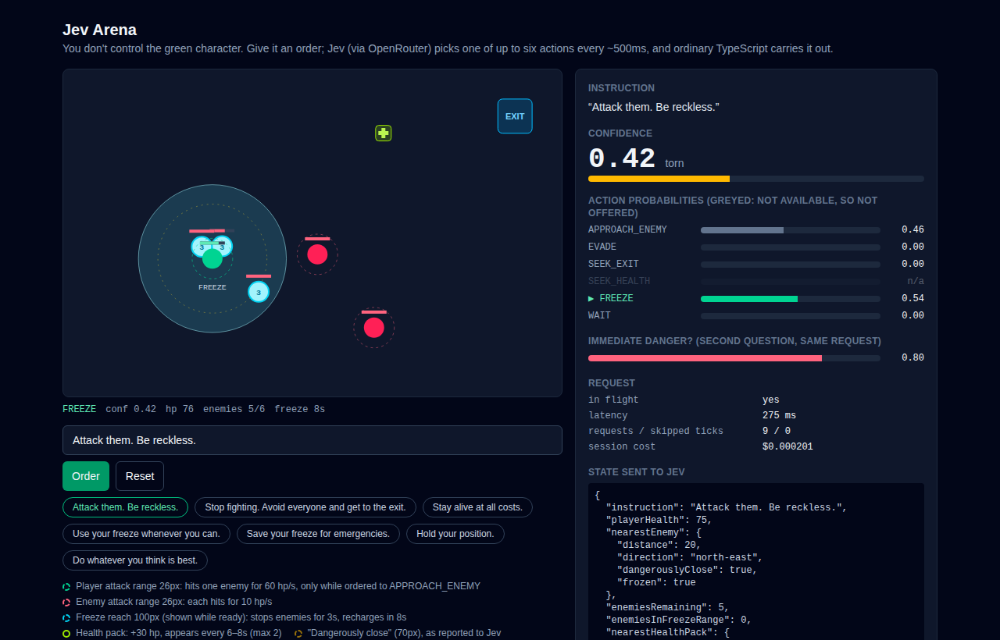

# openrouter-spike-01--jev

A small Urban Tech Creative spike: **React/Vite app → Cloudflare Worker → OpenRouter → Jev**.

A green character in a tiny arena follows a natural-language order ("Attack them. Be reckless.", "Avoid everyone and get to the exit."). Every ~500ms, [Jev](https://openrouter.ai/docs/guides/community/jev) (TypeSafe's decision model, served through OpenRouter's alpha Decisions API) picks one of up to six actions: fight, evade, head for the exit, grab a health pack, fire a freeze blast, or wait. Ordinary TypeScript then carries the action out. A debug panel shows the probabilities and confidence Jev returns.

**Try it live:** <https://openrouter-spike-01--jev.urban-tech-creative.workers.dev>



See [SPEC.md](SPEC.md) for the original brief.

## Run it locally

Requires Node 22.18+ (the harness runs TypeScript directly with Node).

```sh
npm install
cp .dev.vars.example .dev.vars   # then paste your OpenRouter key into it
npm run check-jev                # optional: sanity-check Jev from the command line
npm run dev                      # http://localhost:5199
```

`npm run dev` runs the Worker inside the real Workers runtime (via `@cloudflare/vite-plugin`), so `/api/decide` behaves locally the same way it does when deployed. Nothing is deployed or created in Cloudflare.

A demo session costs well under a tenth of a cent: Jev charges only for input tokens, and each decision costs about $0.00002.

## Checking your OpenRouter account

`scripts/account.ts` is a read-only command-line inspector. It isn't part of the app.

```sh
npm run account                        # this key: spend today/week/month, spend limit, free-tier status
npm run account -- generation <id>     # cost, latency and provider for one request (stats land ~10s after it)
npm run account -- credits             # account balance: credits granted vs used
npm run account -- activity            # last 30 completed UTC days, by model
```

`credits` and `activity` need a **management key**. OpenRouter doesn't show account balance to ordinary API keys. Create one at <https://openrouter.ai/settings/management-keys> and put it in `.env.admin` (gitignored) as `OPENROUTER_MANAGEMENT_KEY=...`. Keep it out of `.dev.vars`: Wrangler loads that file into the Worker, and a management key can create and delete API keys.

## What's reusable

To call a decision model from another UTC project, copy these files:

| File | What it's for | Copy it? |
| --- | --- | --- |
| `worker/openrouter.ts` | OpenRouter client + auth. | As-is. |
| `worker/jev.ts` | Builds the Decisions request (state + typed questions), parses the answers into a small domain object. Pins `typesafe/jev-1.13`. | Change the actions, state description and questions. |
| `worker/validate.ts` | Checks every field of a request, caps its size and drops unknown fields. Jev bills per input token, so a public endpoint that passes text through unchecked lets anyone run up the bill. | Adapt the fields. |
| `worker/index.ts` | `POST /api/decide`: rate limit, validation, error handling. | Adapt the route. |
| `shared/types.ts` | Browser ↔ Worker contract, with no OpenRouter types. | Adapt. |
| `src/lib/useDecisionLoop.ts` | Polls decisions separately from rendering: single-flight, discards stale responses, fails soft. | Useful for any "AI sets intent every N ms" loop. |
| `scripts/check-jev.ts` | Command-line harness that fires canned states at the decision layer. | Write one first for any new decision task. |

Everything under `src/game` and `src/components` is demo-specific.

### Things worth knowing about Jev

- It's not a chat model. You send `state` plus named `questions` of type `choice` (pick one label), `noul` (yes/no probability) or `score` (ordered scale). One request can carry several questions; this demo sends a `choice` and a `noul` together.
- Put the **user's instruction in the question's `instructions`** and the **facts in `state`**. With that split, the same state swings from `APPROACH_ENEMY 1.00` to `SEEK_EXIT 0.95` just by changing the order.
- `confidence` measures how peaked the distribution is, not how correct the answer is. "Escape" given while an enemy is right on top of the character splits EVADE/SEEK_EXIT roughly 50/50 at confidence ~0.35.
- **The choice set can change per request.** Criteria are sent fresh every time, so this demo only offers `FREEZE` while it's recharged and `SEEK_HEALTH` while a pack exists (`availableActions` in `worker/jev.ts`). Jev can't pick an impossible action, and nothing needs validating afterwards.
- Probabilities vary slightly between identical calls. Compare them against thresholds, never for equality.
- Latency is about 250–450ms in practice, so a 500ms tick sometimes overlaps a pending request. The loop skips those ticks rather than queueing them.
- The SDK (`client.alpha.decisions.create`) makes the Worker bundle about 1.7 MB (about 240 KB gzipped). That's fine for Workers. If size ever matters, the endpoint is a single `fetch` to `POST https://openrouter.ai/api/alpha/decisions`.

## What Jev can and can't do (findings)

From `npm run check-jev` experiments and watching full games. Each result is a single run, so treat the numbers as indicative.

**Does well**
- **Weighing a trade-off against health.** With a health pack 60 units away, "do whatever you think is best" picks `SEEK_HEALTH` at 0.13 on 100% health, 0.88 on 60% and 0.97 on 25%. "Attack them. Be reckless." on 25% health still charges in (0.98).
- **Spending a limited resource when it pays off.** "Use your freeze whenever you can" with three enemies in reach gives `FREEZE` 1.00. With none in reach it drops to 0.41 at confidence 0.27.
- **Open-ended orders.** "Do whatever you think is best" produced the most capable play: it dodged, grabbed a pack, re-froze the moment the power recharged, and escaped on 96 hp.

**Does less well**
- **Takes the order literally.** "Use your freeze whenever you can" wasted it straight away on nothing, then chose `WAIT` (0.70) for 9 seconds while being killed. With no freeze available, the order said nothing else, and the order outweighed the danger.
- **Only partly understands "frozen".** Next to a frozen enemy, the danger answer drops from 0.82 to 0.58, not near zero, and "do what's best" still evades it about half the time. Rewording the state from `frozen: true` to `"FROZEN: cannot move or attack right now"` helped a little.
- **Doesn't see an emergency as one.** "Save your freeze for emergencies" with three enemies in reach and one dangerously close picks `EVADE` (0.54) over `FREEZE` (0.27).
- **Tends to fire the freeze early,** before anything is in reach. That happened across several orders.
- **A cleared room under "Attack them"** mostly gives `WAIT` (0.61): there's nothing left to attack, and leaving isn't what it was ordered to do.

Balance, for reference (offline, 200 seeded games with scripted policies): charging in alone never clears the room, health packs alone clear it 21% of the time, and freezing well plus picking up health clears it 76%. So the outcome depends on how well Jev uses the tools, not on luck.

## Experimenting with Jev

Every finding above came from a small experiment, most of them run unattended by a coding agent. There are three kinds, from cheapest to most realistic:

| Question | Command | Cost | How it works |
| --- | --- | --- | --- |
| How does Jev read *this situation*? | `npm run check-jev` | ~$0.0005, seconds | Calls `decide()` from `worker/jev.ts` directly, with hand-written states. No game, no browser. |
| Are the game rules sound? | `npm run balance` | free, ~1s | Plays hundreds of seeded games with scripted stand-ins for Jev. No network. |
| What does Jev do *over a whole game*? | `npm run play-games` | ~$0.001 a game | Drives the real app in a headless browser and logs every decision. Needs `npm run dev` running, and `npx playwright install chromium` once. |

A `play-games` run reads like a match report:

```
## "Use your freeze whenever you can."
    1.7s  APPROACH_ENEMY  hp 100, enemies 6, freeze ready
    2.1s  ❄ froze 1 enemy
    2.1s  FREEZE          hp 100, enemies 6 (1 frozen), freeze 8s
    3.0s  WAIT            hp 100, enemies 6 (1 frozen), freeze 8s
  => DEAD at 8.1s, 0 hp, 6 enemies left
```

It froze one straggler, then stood still for five seconds while being killed: the order only mentioned freezing, and freezing wasn't available. That's the kind of thing you only see over a whole game. `check-jev` then turns it into a precise question you can ask again and again.

Things that worked well, offered as a starting point rather than a procedure:

- **Change one thing at a time.** `check-jev` holds the situation fixed and varies only the order, or holds the order fixed and varies one fact. When the probabilities move, you know what moved them.
- **Suspect the wording before the model.** Jev seemed to ignore `frozen: true`. Rewording it as `"FROZEN: cannot move or attack right now"` and rerunning the same pair showed the wording mattered, but only partly. That makes it a real finding rather than a phrasing accident.
- **Separate game problems from Jev problems.** Under "stay alive", Jev chose EVADE the whole time and still died, because the movement code ran into a corner. `balance` made that obvious (pure evading: 0/100 games survived) and confirmed the fix (100/100). Blaming Jev would have been wrong.
- **One game is one sample.** Jev's probabilities vary slightly from call to call, and a full game compounds that. Use `--runs` to repeat, and trust controlled pairs over one dramatic game.

This is only possible because of how the code is split. `decide()` doesn't care whether it's called by the Worker or a script. `src/game/simulation.ts` is plain functions with injectable randomness, so it can run without a browser. The arena publishes its live state as `data-*` attributes, so automation doesn't have to scrape the screen. Worth keeping when you copy this pattern.

## Deploying

Live at <https://openrouter-spike-01--jev.urban-tech-creative.workers.dev> (Urban Tech Creative's Cloudflare account, pinned by `account_id` in `wrangler.jsonc`).

The deployed Worker uses its own OpenRouter key with a low spend limit, separate from the local one in `.dev.vars`, so public spend is tracked separately and the key can be revoked without affecting local work. To deploy from scratch:

1. Create an OpenRouter key for the deployment, with a low **spend limit**. The deployed Worker is an unauthenticated proxy, rate-limited to 300 requests per minute per IP (see `wrangler.jsonc`).
2. `npx wrangler login`, with access to the account in `wrangler.jsonc`.
3. `npm run deploy`. The page works straight away; `/api/decide` reports that the key isn't set until step 4.
4. Add the key as a Worker secret named `OPENROUTER_API_KEY`: `npx wrangler secret put OPENROUTER_API_KEY`, or in the dashboard under the Worker's Settings → Variables and Secrets (type **Secret**).

Never put the key in a `VITE_*` variable. Vite bundles those into browser code.

## Licence

[MIT](LICENSE). It's a spike: copy whatever is useful.
